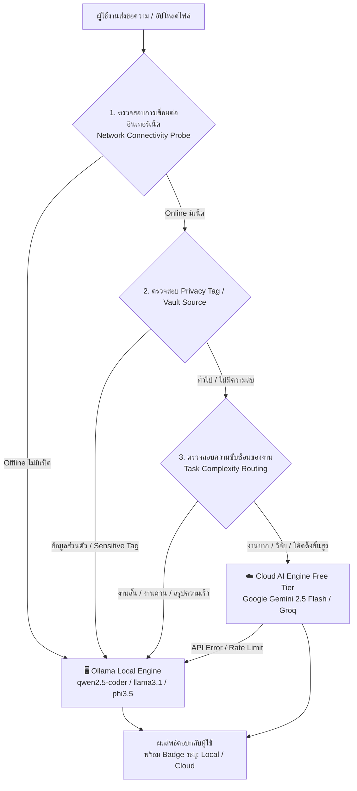

# 📑 Requirement & Architectural Analysis: Hybrid AI System (Local AI + Free Online Cloud AI)

## 1. บทสรุปความต้องการ (Executive Summary)
ความต้องการพัฒนาและผสานรวมระบบ AI แบบ **Hybrid Architecture** ที่สามารถสลับการทำงานระหว่าง **Local AI (ในเครื่อง)** และ **Cloud AI (ออนไลน์)** ได้อย่างชาญฉลาดและไร้รอยต่อ โดยมีเป้าหมายหลัก:
1. **เมื่อออนไลน์ (Online)**: สลับไปใช้โมเดล Cloud AI ฟรีประสิทธิภาพสูง (เช่น Google Gemini API Free Tier หรือ Groq) สำหรับงานที่ต้องใช้การคิดวิเคราะห์ซับซ้อน (Complex Reasoning), เขียนโค้ดยาวๆ หรือค้นหาข้อมูลใหม่
2. **เมื่อออฟไลน์ (Offline) หรือต้องการความเป็นส่วนตัว (Privacy-First)**: ใช้ Local AI ในเครื่อง (ผ่าน Ollama) สำหรับการประมวลผลไฟล์เอกสารส่วนบุคคล (Personal Vault), ความลับทางธุรกิจ หรือทำงานในขณะไม่มีอินเทอร์เน็ต ข้อมูลไม่รั่วไหล 100%

---

## 2. วัตถุประสงค์และประโยชน์หลัก (Key Objectives & Benefits)

| มิติการทำงาน | Local AI (ในเครื่อง) | Cloud AI (ออนไลน์ฟรี) | ผลลัพธ์ในระบบ Hybrid |
| :--- | :--- | :--- | :--- |
| **ความเป็นส่วนตัว (Privacy)** | สูงสุด 100% (ข้อมูลไม่ออกนอกเครื่อง) | ข้อมูลส่งผ่าน API ภายนอก | 🔒 เลือกลง Local อัตโนมัติเมื่อแตะไฟล์ส่วนตัว/Vault |
| **ความต่อเนื่อง (Availability)** | รันได้ตลอดเวลาแม้ออฟไลน์ | ต้องใช้อินเทอร์เน็ต | ⚡ Fallback กลับมา Local ทันทีหากเน็ตหลุด/API Error |
| **ความสามารถ (Intelligence)** | จำกัดตามขนาด GPU/RAM เครื่อง | สเปกใหญ่ระดับ State-of-the-Art | 🧠 ได้โมเดลฉลาดระดับเรือธงฟรีเมื่องานซับซ้อน |
| **ความเร็ว & ค่าใช้จ่าย** | ฟรี ไม่จำกัด Token แต่กินสเปกเครื่อง | ฟรี (Free Tier) ตอบสนองเร็วมาก (High TPS) | 💰 คุ้มค่า 0 บาท และประหยัดทรัพยากรเครื่องเมื่อต่อเน็ต |

---

## 3. แผนภาพสถาปัตยกรรมการทำงาน (Hybrid Routing Architecture)

---

## 4. ลำดับขั้นตอนการตัดสินใจของ Router (4-Step Decision Pipeline)

1. **Step 1: Network Health Check (ตรวจสถานะเน็ต)**
   - ตรวจจับ Ping/DNS ของระบบแบบ Non-blocking (Latency < 50ms)
   - หากตรวจไม่พบอินเทอร์เน็ต ระบบจะ Forced Route เข้า **Local AI (Ollama)** ทันที
2. **Step 2: Privacy & Vault Boundary (ตรวจความลับ)**
   - หากคำถามมีการอ้างอิงเอกสารจาก `storage/vault/` หรือผู้ใช้เปิดโหมด *Privacy Shield*
   - บังคับประมวลผลผ่านโมเดลในเครื่อง 100% ห้ามส่ง Payload ออกนอกเครื่อง
3. **Step 3: Complexity & Intent Classification (วิเคราะห์ความยากของงาน)**
   - **General / Light Tasks**: สรุปข้อความสั้น, ตอบคำถามเร็ว $\rightarrow$ Local AI (`qwen2.5:3b` หรือ `qwen2.5-coder:7b`)
   - **Complex Reasoning / Deep Coding / Research**: งานวิเคราะห์ลึก $\rightarrow$ Cloud AI (`Gemini 2.5 Flash Free Tier` หรือ `Groq Llama-3.3-70B`)
4. **Step 4: Graceful Fallback (ระบบสำรองฉุกเฉิน)**
   - หาก Cloud AI เกิด Rate Limit (429) หรือ Timeout $\rightarrow$ สลับกลับมาตอบด้วย Local AI อัตโนมัติโดยที่ผู้ใช้ไม่ต้องกดส่งใหม่

---

## 5. การวิเคราะห์ความพร้อมของระบบปัจจุบัน (OGCAI Status & Gap Analysis)

### 5.1 สิ่งที่มีอยู่แล้วในระบบ (Implemented Assets)
- ✅ **Ollama Engine Integration**: [`ollama_service.py`](file:///d:/OGCAI/backend/app/services/ollama_service.py) มีระบบเชื่อมต่อ Local AI, Streaming API และ Model Catalog
- ✅ **Two-Tier Router**: [`router_service.py`](file:///d:/OGCAI/backend/app/services/router_service.py) มีระบบคัดกรอง Tier 1 (Regex 0ms) และ Tier 2 (AI Classifier)
- ✅ **Storage Isolation**: มีโฟลเดอร์แยกชัดเจน `storage/vault/`, `storage/db/`, `storage/vectors/`
- ✅ **Chat Schema**: มี `RouteDecision` พร้อมรองรับการคืนค่าโมเดลและ Badge สี

### 5.2 สิ่งที่ต้องพัฒนาเพิ่ม (To-Do Implementation Roadmap)
1. **Cloud AI Provider Module**:
   - สร้าง Service เชื่อมต่อ Google Gemini API Free Tier (`app/services/cloud_ai_service.py`)
   - รองรับ Google Gemini 2.5 Flash / Flash Lite และ Fallback Providers (เช่น Groq / OpenRouter)
2. **Network Connectivity Probe**:
   - เพิ่มฟังก์ชันเช็กสถานะออนไลน์/ออฟไลน์แบบ Asynchronous ใน Background
3. **Hybrid Router Enhancement**:
   - ปรับปรุง `router_service.py` ให้มี Routing Policy: `LOCAL_ONLY`, `PREFER_CLOUD`, `HYBRID_AUTO`
4. **UI Visual Indicators**:
   - แสดง Badge สถานะชัดเจนที่หน้าบ้าน เช่น 🟢 `Local: Qwen-7B (Offline/Private)` หรือ 🔵 `Cloud: Gemini Flash (Online Free)`

---

## 6. ข้อกำหนดโมเดลที่แนะนำ (Recommended Model Matrix)

| ปลายทาง | ประเภท | ชื่อโมเดลที่แนะนำ | จุดเด่น | โควตา/การใช้งาน |
| :--- | :--- | :--- | :--- | :--- |
| **Local (ในเครื่อง)** | General & Code | `qwen2.5-coder:7b` | ภาษาไทยดีมาก, เขียนโค้ดแม่นยำ | ฟรี ไม่จำกัด (ใช้ทรัพยากรเครื่อง) |
| **Local (ในเครื่อง)** | Advisor / Persona | `llama3.1:8b` | ให้คำปรึกษา เป็นธรรมชาติ | ฟรี ไม่จำกัด |
| **Local (ในเครื่อง)** | Fast / Fallback | `qwen2.5:3b` / `phi3.5` | สเปกเบา รวดเร็ว เหมาะกับงานคัดแยก | ฟรี ไม่จำกัด |
| **Cloud (ออนไลน์)** | Primary Fast & Smart | **Google Gemini 2.5 Flash** | รองรับ Context สูงมาก, คิดเลข/โค้ดเก่ง | **Free Tier** (15 RPM / 1M TPM ฟรี) |
| **Cloud (ออนไลน์)** | Secondary Backup | **Groq (Llama-3.3-70b)** | ความเร็วการ Generate สูงสุด (100+ tok/s) | **Free Tier** |
